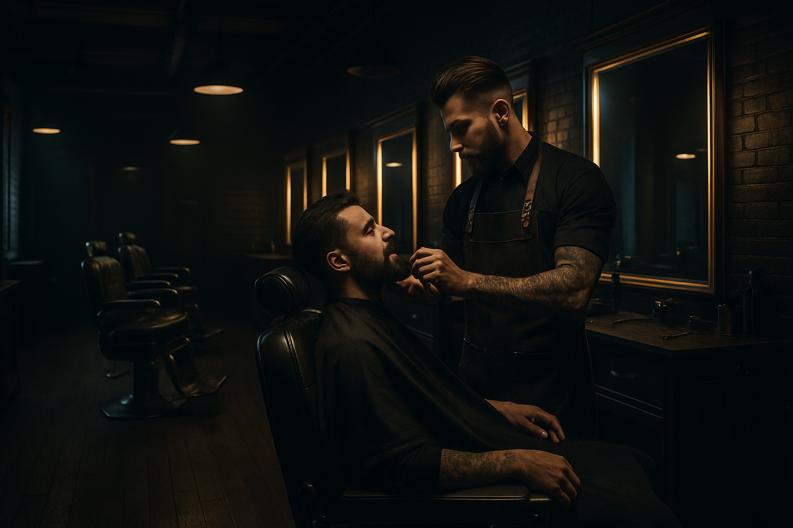

# 💈 Só os da Barbearia | Experiência Premium em Joinville



<p align="center">
  
  
  
  
  
</p>

---

## 🖋️ Sobre o Projeto

O **Só os da Barbearia** é uma landing page de alto padrão desenvolvida para uma barbearia premium localizada em Joinville, SC. O projeto foca em proporcionar uma experiência visual sofisticada, refletindo a qualidade e o profissionalismo dos serviços oferecidos, como visagismo, cortes modernos e tratamentos de barba.

> "Mais do que uma barbearia, um refúgio para o homem moderno. Experiência premium, ambiente exclusivo e profissionais de elite."

---

## ✨ Funcionalidades e Diferenciais

O site foi construído com foco em **conversão** e **experiência do usuário (UX)**, apresentando:

- **Design Premium:** Paleta de cores em preto e dourado (#c5a059) para transmitir luxo.
- **Responsividade Total:** Adaptado para smartphones, tablets e desktops.
- **SEO Avançado:** Meta tags configuradas, dados estruturados (JSON-LD) e semântica HTML5.
- **Agendamento Facilitado:** Botões de CTA estratégicos integrados diretamente ao WhatsApp.
- **Animações Fluidas:** Uso da biblioteca AOS (Animação ao Scroll) para uma navegação dinâmica.
- **Tabela de Preços Modal:** Lista completa de serviços acessível sem sair da página principal.

---

## 🛠️ Tecnologias Utilizadas

O projeto utiliza as tecnologias mais modernas para desenvolvimento web front-end:

| Tecnologia | Finalidade |
| :--- | :--- |
| **HTML5** | Estrutura semântica e acessibilidade. |
| **CSS3** | Estilização avançada com variáveis e Flexbox/Grid. |
| **JavaScript (ES6+)** | Lógica de interatividade e manipulação de DOM. |
| **Bootstrap 5** | Framework para layout responsivo e componentes. |
| **AOS JS** | Biblioteca para animações de entrada ao rolar a página. |
| **Google Fonts** | Tipografia refinada (Playfair Display & Poppins). |

---

## 📸 Visual do Projeto

### Seções Principais
O projeto conta com uma estrutura completa para apresentar o negócio:

1. **Hero Section:** Banner de impacto com vídeo de fundo e CTA principal.
2. **Benefícios:** Diferenciais competitivos da barbearia.
3. **Serviços:** Cards detalhados com imagens dos principais serviços.
4. **Depoimentos:** Prova social com avaliações de clientes reais.
5. **Sobre:** História e valores da marca.
6. **Localização:** Mapa integrado e informações de contato.


*Exemplo de um dos serviços premium oferecidos.*

---

## 📁 Estrutura de Arquivos

```text
so_os_da_barbearia/
├── index.html          # Página principal (Single Page)
├── css/
│   └── styles.css      # Estilos personalizados e variáveis
├── js/
│   └── script.js       # Lógica de scroll, animações e modal
├── images/             # Assets visuais (JPG, SVG)
│   ├── logo/           # Identidade visual
│   └── ...             # Fotos dos serviços e ambiente
└── videos/             # Vídeos promocionais para o Hero
```

---

## 🚀 Como Executar o Projeto

1. Clone este repositório ou baixe os arquivos.
2. Certifique-se de que a estrutura de pastas está correta.
3. Abra o arquivo `index.html` em qualquer navegador moderno.

### Configuração de Contato
Para alterar o número do WhatsApp, localize o seguinte link no `index.html` e substitua pelo seu número:
```html
https://wa.me/5547991597258
```

---

## 👨‍💻 Créditos

Desenvolvido com ❤️ por **Bruno Mariano | ModoWeb**.

---

<p align="center">
  <b>Só os da Barbearia - Estilo & Tradição</b><br>
  Joinville, SC
</p>
